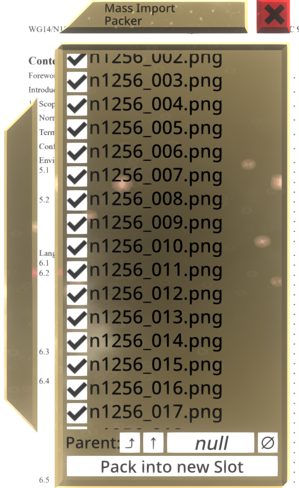

# NeosMassImportPacker

A [NeosModLoader](https://github.com/zkxs/NeosModLoader) mod for [Neos VR](https://neos.com/) that creates a wizard for reparenting of imports.

## Installation
1. Install [NeosModLoader](https://github.com/zkxs/NeosModLoader) and [NeosAssetImportHook](https://github.com/mpmxyz/NeosAssetImportHook).
2. Download [NeosMassImportPacker.dll](https://github.com/mpmxyz/NeosMassImportPacker/releases/latest/download/NeosMassImportPacker.dll).
3. Copy it into the `nml_mods` directory inside your Neos install.
4. Start the game. If you want to verify that the mod is working you can check your Neos logs.

## Usage
- A wizard is spawned whenever you import multiple assets in a short timeframe.
- You can check/uncheck individual imports to select which one will be moved.
- When no parent object is selected a new one will be created under Root.
- Hit the button "Pack into new Slot"/"Reparent" to move all selected imports into a new/existing parent.

## Example

